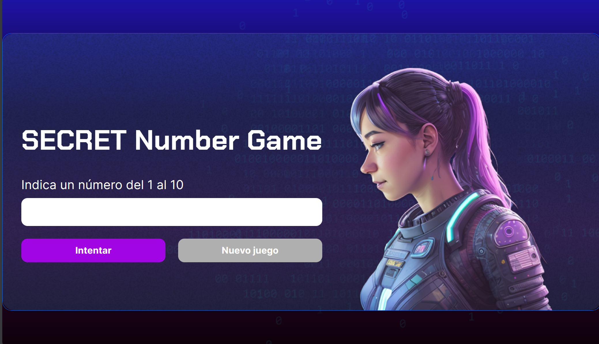
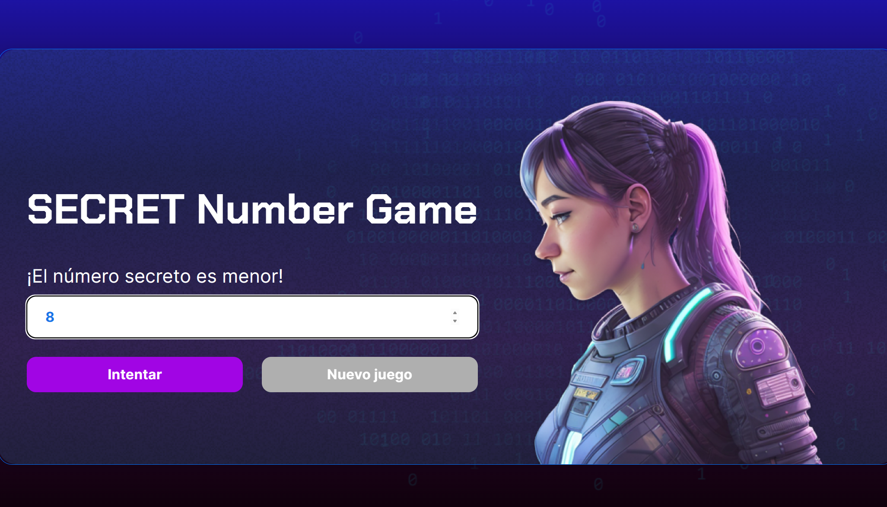
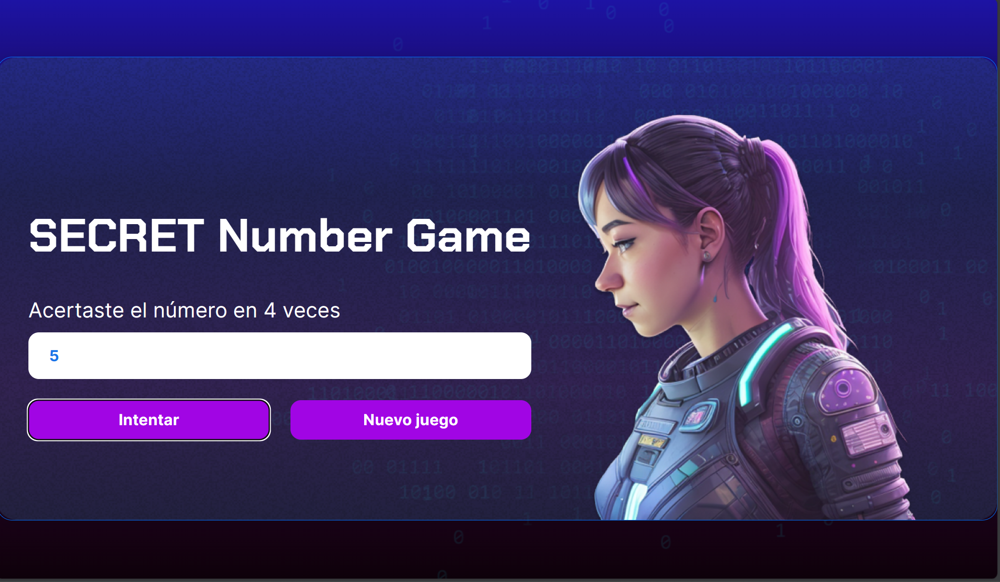

# SECRET-Number-Game
Juego del número secreto.

Este proyecto creado para el programa ORACLE Next Education junto con Alura Latam, es una página web adaptable a dispositivos de distintos tamaños (este tipo de sitio web se conoce en inglés como "responsive"). 

El propósito de esta página web es hacer que el usuario pueda jugar a adivinar un número secreto, en donde le dirá si su número es mayor, menor o si acertó el número y el número de intentos en los que lo hizo.

### Capturas de pantalla:

Primera parte de la página web:

 

Si el número es menor:

Si el número es mayor:

Si acertaste:

## Tecnologías

Esta página web fue creada con:

* HTML
* CSS
* JavaScript 

## Español

El título de la página web está escrito en inglés y el texto en español, las clases y atributos personalizados están en español.

Link del demo: https://ximenaramireza.github.io/SECRET-Number-Game/

